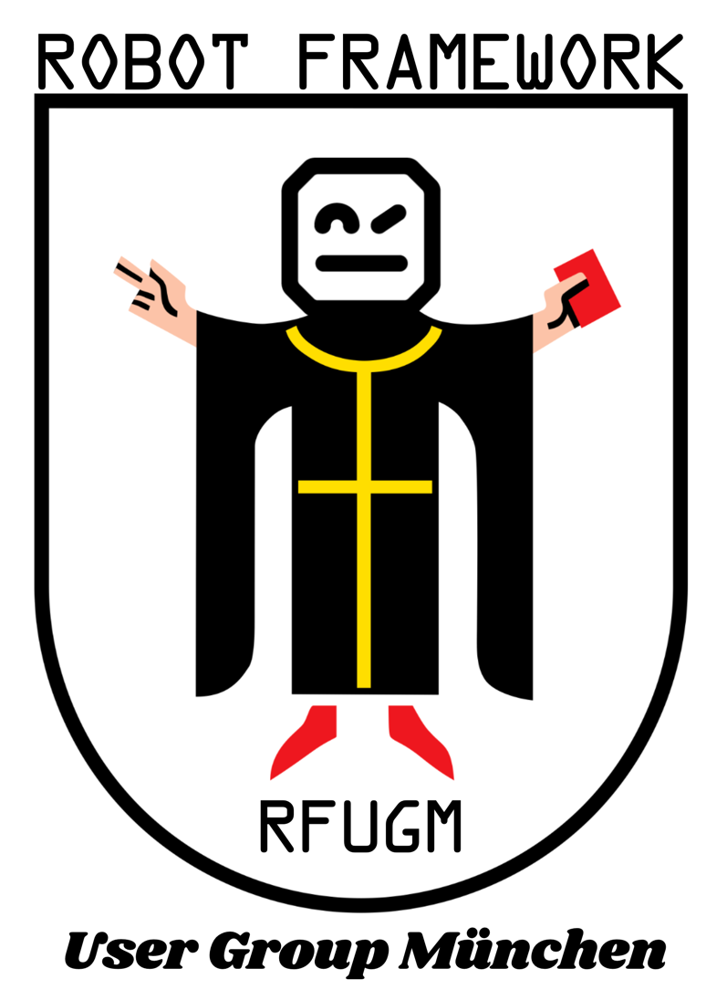

  

# rf-dojos – Robot Framework User Group München

Dojo-Abende der RFUGM: jeder Teilnehmer löst dieselbe Robot-Framework-Aufgabe
individuell, die Lösungen werden anschließend live thematisch verglichen.

Ein Dojo (sprich: *doodscho*) ist der traditionelle Trainingsraum für
japanische Kampfkünste wie z. B. Karate. Ein Raum, in dem man seine
Fähigkeiten ausbaut und gemeinsam lernt – genau das richtige Motto für
unser neues RFUGM-Format!

So läuft es ab:

**„Keiko"** = individuelles Training: Nach einem kurzen Briefing krempeln
wir die Ärmel hoch, klappen unsere Laptops auf und machen uns an die
Arbeit. Unser Buddy-System garantiert, dass keiner zurückbleibt.

**„Hyōka"** = gemeinsames Einschätzen: Da wird's spannend! Mit einer
ausgeklügelten Methodik lernen wir schrittweise, was die anderen so gebaut
haben.

- [Anleitung für Teilnehmer](TEILNEHMER.md) – Ablauf, Regelwerk & Submission-Workflow
- [Anleitung für Organisator](ORGANISATOR.md) – Konzept, Moderation & Viewer-Bedienung
- [`viewer/`](viewer/) – Browserbasiertes Vergleichs-Tool für den Hyōka

## Mitmachen

Diese Dojos gibt es aktuell:

- [Dojo #1 – Web Testing](dojos/dojo-01-web-testing/README.md)

Aufgabenstellung und Submission-Workflow stehen jeweils im README des
Dojos, verlinkt oben. Den allgemeinen Ablauf und das Regelwerk findest du
in der [Anleitung für Teilnehmer](TEILNEHMER.md).
